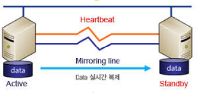
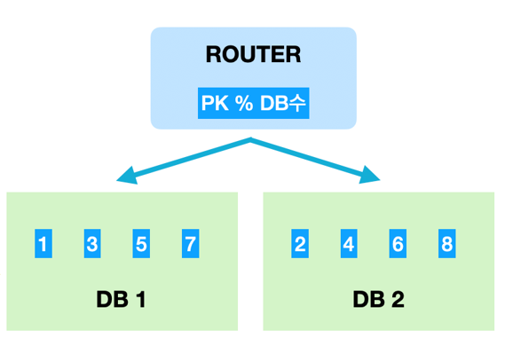
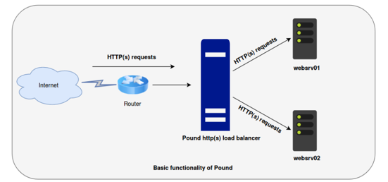
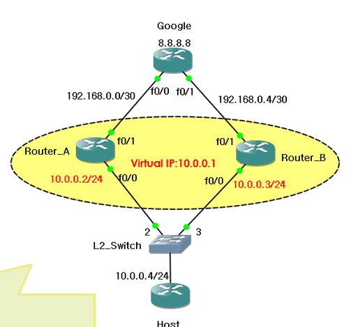

# HA 정의 및 필요성

## HA 필요성
- 장애 유연성 : 장애 발생 시 서비스 중단 최소화(99.999% Five Nine)
- 서비스 연속성 : 기업의 Mission Critical한 업무에 대한 지속적인 서비스 필요성 증대
- Semi-FT시스템 : 고비용의 결함허용시스템(FT) 대안

## HA 용어 정리
High Availability (고가용성)
- 서버와 네트워크, 프로그램등의 정보 시스템이 오랜 시간 지속적으로 정상 운영이 가능한 성질
- 시스템이 이슈 발생시 얼마나 빨리 복구하는가

### 기본적인 용어
Active, Standby, Master, Slave, Backup

Active : client로 부터 request를 받아서 처리하는 역할(ing 현재 진행)
Standby : 예측한 에벤트(장애 등)가 발생했을 때, Active 대신 request를 처리하는 역할(active 감시)

Master : 하나의 역할을 수행 하는데 있어 동작의 주체가 되는 역할을 수행
Slave : '주로' 마스터의 지시에 따라, 종속적인 역할을 수행
Backup : 특정 서버의 역할을 대체하기 위해, 준비된 서버 (Standby 서버)

### 사용 예시

### Cache 서버의 이중화
- cache 서버의 다운 발생 시, 대체할 수 있는 **미러링 서버**를 구성
- Active/ Standby 구성

**Heartbeat란?**
정상적인 작동을 나타내거나 컴퓨터의 시스템의 다른 부분을 동기화하기 위해 하드웨어 또는 소프트웨어에 의해 생성되는 주기적인 신호

**cache server 특징**
cache server는 휘발성 메모리에 저장하는 방식으로, 서버에 이슈가 발생했을 경우에 데이터를 손실할 가능성이 높다. 
때문에 Cache server를 사용하는 경우에는 리스크를 hedge하기 위해 이중화하는 경우가 많다.

**이중화와 미러링**
이중화는 클러스터링의 방식 중 하나로 서버를 다중화하는 방식이다. 미러링은 Data의 복제를 뜻함  
주의할 점은 이중화와 미러링의 의미를 혼동하지 않는 것것

### DB Sharding
- Master는 각 shard의 node 정보를 저장
- Slave에는 분할 방식에 따라 분산 저장
- Active / Active 와 Master/Slave 구성
- Scale - out이 쉽게 가능

**Sharding** : DB 트레픽을 분산할 목적으로 수평 분할하는 방법이다. 개개의 파티션을 샤드라고 부른다. 분할 방식으로는 모듈러 샤딩, 레인지샤딩이 있다.

### Load Balancer 아래에 n개의 server 구성
- 부하분산의 목적
- n개의 Active Server로 구성
- 모든 Server가 Active

**Load balancing**
- 하나의 인터넷 서비스가 발생하는 트래픽이 많을 때 여러 대의 서버가 분산처리하여 서버의 로드율 증가, 부하량, 속도저하 등을 고려하여 분산처리하는 방법

### VRRP (Virtual Router Redundancy Protocol) 구성
- Master Router와 Backup Router로 구성
- Master Router가 '주'로서 동작하고 Master의 장애 시 Backup Router가 대체
- Active/Standby 또는 Master/Backup 구성

**Virtual IP**
VIP는 가상 아이피를 말하며 하나의 호스트에 여러 개의 IP주소를 할당하는 기술로 VIP는 대장과 같은 역할을 수행행

### 참고자료
<a href="https://kkangi.tistory.com/19">HA 개념 정리</a>