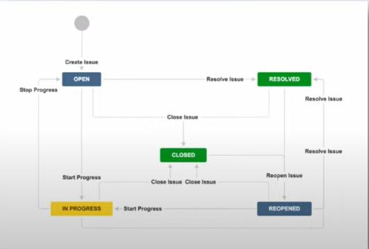
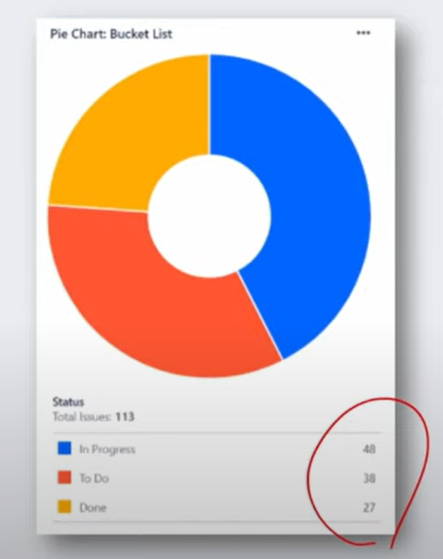

Jira를 어떻게 사용해야 통할까?

### 1. workflow 
- 이슈가 생성부터 완료까지 거치는 단계와 프로세스(status, closed)
1. 이슈 상택확인
2. 진행률 파악
3. 병목 구간 식별
4. 배포 가능여부 판단.

in ssafy

실제로 쓰는 경우

Widget 사용 예시

JQuery 사용 예시
- 예) 완료되지 않은 이슈 중 최근 7일간 업데이트가 일어나지 않은 티켓을 오래된 순으로 검식

### 2. Release
프로젝트 일정에 맟춰 기능 개발 및 배포를 체계적으로 관리
- 체계적인 배포
- 버전 관리
- 릴리즈 노트 생성

Release note 예시

Release Burndown report 예시시

### 3. Component
프로젝트를 분류하고 체계적으로 관리할 수 있게 도와주는 요소
- 담당자 자동 지정
- 이슈 필터링 최적화
- 릴리즈 계획 수립 

Component 디자인 예시

feature 단위로 디자인한 예시

Component 사용 예시

Component widget 예시
