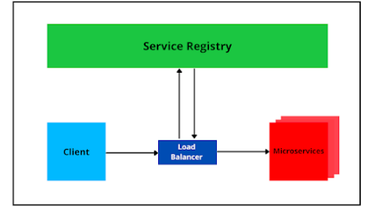
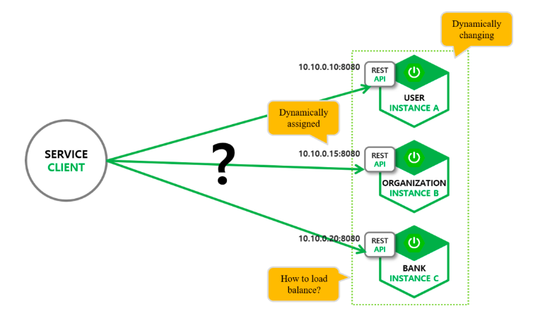

# 🌍 Eureka

## 🌐 서비스 레지스트리와 서비스 디스커버리
서비스 간 통신 시 서비스 위치 (포트, 호스트)가 정적이던 전통적인 어플리케이션 / 아키텍처와는 달리 주소가 동적으로 변화하고 (클라우드 환경, 오토 스케일링, 컨테이너 기반의 배포 등) 서비스 역시 무수히 많은 마이크로서비스에서는 서비스 위치에 대한 관리가 많아 복잡해지게 되는데, 이를 해결하기 위해 서비스 레지스토리 패턴과 서비스 디스커버리 패턴이 등장!!

#### 서비스 레지스트리
- 마이크로서비스 / 관리, 운영을 위한 기반 서비스의 주소와 유동적인 IP를 매핑하여 저장하는 패턴

#### 서비스 디스커버리
- 클라이언트가 여러 개의 마이크로서비스를 호출하기 위해 최적의 경로를 찾아주는 라우팅, 적잘한 부하 분산을 위한 로드 밸런싱 기능을 제공해야하는데 이와 관련된 패턴

## 🌐 Spring Cloud Eureka
- Spring Cloud Eureka는 **서비스 레지스트리와 서비스 디스커버리**를 지원하기 위한 라이브러리이며 **서버 / 클라이언트**로 나뉩니다.

### Eureka Server
- REST API 기반으로 다양한 언어에서 사용 가능
- 레지스트리의 모든 정보는 모든 Eureka Client에서 복제되어 있으며 가용 중인 모든 서비스들의 목록을 확인할 수 있고 30초마다 목록이 갱신됨
- Eureka Client들에게 자신이 가지고 있는 Eureka Client들의 정보를 공유, Eureka Client들 (대표적으로 Spring Gateway, Ribbon, Zipkin 등)에서 이를 사용
- 일정 간격으로 Client로부터 핑을 전달 받아 가용 상태임을 확인하며 일정 횟수 이상 핑이 안된다면 Eureka Client로 레지스트리에서 제외 시킴
- 가용 상태의 서비스 목록 확인 시 서비스 이름을 기준으로 탐색, 로드 밸런싱을 위해 내부적으로 Ribbin (클라이언트 측의 로드 밸런서)를 사용

### Eureka Client
- 서비스 시작 Eureka Server에 자신의 정보를 등록
- 등록된 후 30초마다 레지스트리에 핑을 전송하여 자신의 가용 상태를 알림
- 레지스트리로부터 다른 Eureka Client의 서비스 정보를 확인할 수 있음

<a href="https://velog.io/@mrcocoball2/Spring-Cloud-Spring-Cloud-Eureka-%EA%B8%B0%EB%B3%B8-%EA%B0%9C%EB%85%90-%EB%B0%8F-%ED%99%9C%EC%9A%A9-74mogeh0">[Spring Cloud] Spring Cloud Eureka - 기본 개념 및 활용</a>

