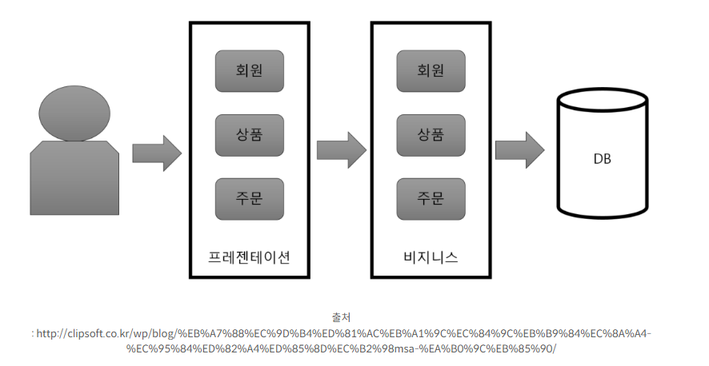
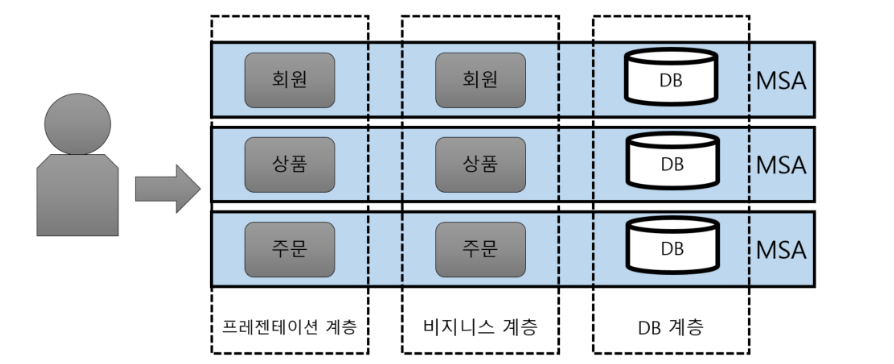

# 📖 MSA란 무엇인가?
- MicroService Architecture의 줄임말
- 작고 독립적인 서비스들의 집합으로 구성된 애플리케이션 구조

## 🔖 모놀리식 아키텍처 vs 마이크로서비스 아키텍처

### 📌 모놀리식 아키텍처 (Monolithic Architecture)
- 전통적인 개발 방식으로 하나의 프로젝트에 모든 기능을 함께 배포
- 코드 베이스가 커질수록 개발 및 배포에 복잡성이 증가
- 웹의 경우 WAR파일로 빌드되어 WAS에 배포하는 형태를 말함

예시)

- 위의 그림과 같이 모듈단위로 쪼개는 것이 아닌 하나의 프로젝트로 전체 애플리케이션을 묶어서 개발하는 방식
- 이의 경우 회원, 상품, 주문뿐만 아니라 여러 개의 비즈니스 로직이 추가된다면 코드베이스가 커지는 구조이다.

- 간단한 소규모 프로젝트( 사이드 프로젝트 ), 프로토타입 제작 및 단기 프로젝트 

#### 모놀리식 장점
- 초기 개발에 유리하며 빠르게 프로토타입을 개발할 수 있다.
- 필요한 기능을 한 번만 호출하기 때문에 복잡한 통신 없기 직접 사용할 수 있다.

#### 모놀리식 단점
- 코드 베이스가 커질수록 복잡해지고 유지관리 및 확장이 어려워진다.
- 일부 기능을 수정하거나 업데이트를 하려면 전체 애플리케이션을 재배포해야 한다.
- 부분 장애가 전체 서비스의 장애로 확대될 수 있다. 
- 부분적인 *Scale-out(여러 server로 나누어 일을 처리하는 방식)이 어렵다
- 한 Framework와 언어에 종속적이다
    -Spring framework를 사용할 경우, blockchain 연동 모듈을 추가할 때 node.js를 사용하는 것이 일반적이며 강세이다. 그러나 java를 이용하여 해당 모듈을 작성할 수 밖에 없다. 선정했던 framework가 Spring이기 때문이다.

### 📌 마이크로서비스 아키텍처 (Microservice Architecture)
- 여러 개의 작은 서비스로 구성되어 각 서비스가 독립적으로 개발되고 배포되는 구조
- MSA로 구성되어 있는 애플리케이션의 경우 전체 시스템이 분산되어 있어 개발, 배포가 독립적으로 가능하며 확장성, 유지관리가 용이해진다.

예시)

- 애플리케이션을 작은 독립적인 서비스로 분리
- 각 서비스는 모듈 또는 프로젝트로 나눠서 개발 및 관리를 진행한다.
- 이렇게 하면 독립적인 개발 및 배포가 가능하여 개별적인 배포 주기를 가질 수 있음
- 대규모 및 복잡한 프로젝트, 시스템을 독립적으로 개발하고 확장해야 하는 경우

#### MSA 특징
MSA는 API를 통해서만 상호작용할 수 있다. 즉, 마이크로 서비스는 서비스의 end-point(접근점)을 API 형태로 외부에 노출하고, 실질적인 세부 사항은 모두 추상화한다. 내부의 구현 로직, 아키텍처와 프로그래밍 언어, 데이터베이스, 품질 유지 체계와 같은 기술적인 사항들은 서비스 API에 의해 철저하게 가려진다. 
따라서 **SOA(Service Oriented Architecture)**의 특징을 다수 공통으로 가진다. 

#### MSA의 장점
- 서비스 간 독립성으로 인해 확장성과 유연성이 높아진다.
- 기능 고립성이라는 특징 때문에 일부 서비스가 실패하더라도 전체 시스템에 큰 영향을 미치지 않는다.

- 각각의 서비스는 모듈화가 되어있으며 이러한 모듈까리는 RPC 또는 message-driven API등을 이용하여 통신한다. 이러한 MSA는 각각 개별의 서비스 개발을 빠르게 하며, 유지보수도 쉽게할 수 있도록 한다. 
- 팀 단위로 적절한 수준에서 기술 스택을 다르게 가져갈 수 있다. 회사가 java의 spring 기반이라도 MSA를 적용하면 node.js로 블록체인 개발 모듈을 연동함에 무리가 없다. 
- 마이크로서비스는 서비스별로 독립적 배포가 가능하다. 따라서 지속적인 배포 CD도 모놀로식에 비해서 가볍게 할 수 있다.
- 마이크로서비스는 각각 서비스의 부하에 따라 개별적으로 scale-out이 가능하다. 메모리, CPU적으로 상당부분 이득이 된다.

**💡 스케일 아웃(Scale-Out)**
- 스케일 아웃은 서버를 여러 대 추가하여 시스템을 확장하는 것을 말한다. 
- 서버가 여러 대로 나뉘기 때문에 각 서버에 걸리는 부하를 균등하게 해주는 '로드밸런싱'이 필수적으로 동반되어야 한다. 
이처럼 여러 대의 서버로 나눠 시스템을 확장하기 때문에 수평 스케일로 불리기도 한다.

**💡스케일 업(Scale-Up)**
- 스케일 업은 기존 서버의 사양을 업그레이드해 시스템을 확장하는 것을 말한다. 
- CPU나 RAM 등을 추가하거나 고성능의 부품, 서버로 교환하는 방법이다. 
이처럼 하나의 서버의 사양을 업그레이드 하기 때문에 수직 스케일로 불리기도 한다.

#### MSA의 단점
- 서비스 간 통신이 필요하며, 서로 간 연결 구축 및 관리의 복잡성이 증가한다.
    - 서비스가 모두 분산되어 있어 내부 시트템의 통신을 어떻게 가져갈지 정해야 함
    - 통신의 장애와 서버의 부하 등이 있을 경우 어떻게 transaction을 유지할지 결정하고 구현해야함
- 초기 개발 및 통신 등에 시간이 소요된다.
- 통합 테스트가 어렵다. 개발 환경과 실제 운영환경을 동일하게 가져가는 것이 쉽지 않다.
-  MSA에서는 비즈니스에 대한 DB를 가지고 있는 서비스도 각기 다르고, 서비스의 연결을 위해서는 통신이 포함되기 때문에 트랜잭션을 유지하는게 어렵다. 

## Spring을 활용해서 구현한다면?
기능 별로 서버를 여러 개로 분리했기 때문에 client에서 server로 요청을 보낼 때 어떤 서버로 요청을 전달해야 할 지 정해줘야 함

1. spring gateway
마이크로서비스 아키텍처에서 API 게이트웨이를 구축하기 위한 라이브러리. API 게이트웨이는 클라이언트와 마이크로 서비스 간의 통신을 중계하고 라우팅하는 역할을 수행  
Eureka와 같은 서비스 디스커버리 클라이언트와 통합하여 동적으로 서비스를 발견할 수 있다.

2. spring cloud eureka
마이크로서비스 아키텍처에서는 많은 수의 서비스 인스턴스가 동적으로 생성되고 제거되기 때문에, 이러한 서비스들을 효과적으로 관리하고 찾을 수 있는 메커니즘이 필요  
서비스 인스턴스들은 Eureka 서버에 자신의 정보를 등록하고 클라이언트는 Eureka 서버에 등록된 서비스를 검색할 수 있다.
이를 통해 동적으로 시비스 인스턴스를 찾아 요청을 전달할 수 있음
- eureka 서버가 제공하는 기능은 쿠버네티스에서도 제공하고 있음

3. Feign Client
MSA를 적용함으로써 서버들이 기능별로 분리됨에 따라 각 서버는 자신이 관할하는 DB에만 직접 접근할 수 있게 되었음. 그로 인해 자신이 관할하지 않는 DB의 데이터가 필요한 경우, 해당 DB를 담당하고 있는 서버에게 데이터를 요청해야함 
서버 간 통신을 하기 위해 **Feign Client**를 사용하여 기존의 RestTemplate보다 Rest API를 사용하는데 필요한 설정을 간소화하고 이로 인해 비지니스 로직에 더 집중할 수 있음

### 출처

<a href="https://mozzi-devlog.tistory.com/34">[MSA] 마이크로서비스 아키텍처(MSA)란 뭘까?</a>\
<a href="https://wooaoe.tistory.com/57"> [개발개발 울었다:티스토리]</a>
<a href="https://github.com/wlwlsus/allback-with-k8s">Can you get it - 터지지 않는 티켓팅 플랫폼</a>