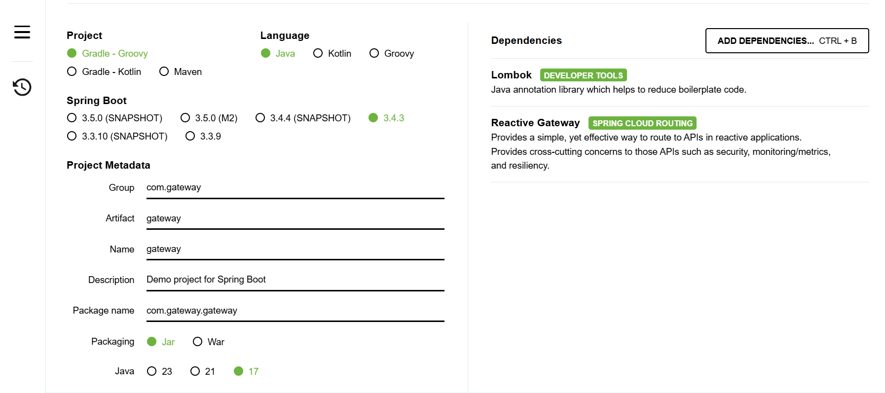
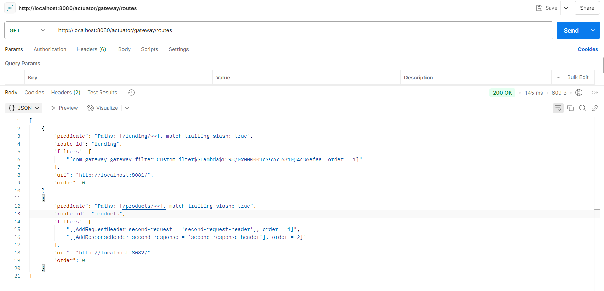

# Spring Cloud Gateway 연습해보기

## 1. 요청을 받을 두 개의 서비스 준비
- gateway로 연결할 서비스 들을 미리 준비
    - 나는 funding과 products 두개의 서비스 만들었다.
- Lombok, Spring Web 의존성만 간단하게 추가해서 만들자 

### 1.1 yml 설정 추가
- funding : 8081
- products : 8082

#### application.yml 
```
server:
  port: 8081
```

#### Controller
- 서비스 별로 test API를 하나씩 만든다.

```
@RestController
@RequestMapping("/funding")
public class FundingController {

    @Value("${server.port}")
    private String port;

    @GetMapping("/check")
    public String check() {
        return String.format("funding port:%s", port);
    }
}
```

## 2. Spring Cloud Gateway 설정
- lombok, gateway dependency를 추가해서 프로젝트 생성
- gateway 코드 작성방식은 yml이나 Java Code로 작성하는 방식 두 가지가 있음음




### 2.1 yml로 작성하는 법

#### application.yml
```
server:
  port: 8080

spring:
  cloud:
    gateway:
      routes:
        - id: funding
          uri: http://localhost:8081/
          predicates:
            - Path=/funding/**
        - id: products
          uri: http://localhost:8082/
          predicates:
            - Path=/products/**
          filters:
            - AddRequestHeader=second-request, second-request-header
            - AddResponseHeader=second-response, second-response-header
```

1. 등록된 서비스에 요청이 gateway로 들어옴
    - http://localhost:8081/funding
2. 요청받은 url의 조건을 predicates에서 탐색
    - (cloud.gateway.routes.id.predicate의 /funding/** 가 확인됩니다.)
3. 해당 route에 해당되는 url인 http://localhost:8081/ 으로 요청을 전달

**products 적용된 filters 부분은 RequestHeader와 ResponseHeader를 추가하기 위해 사용되는 방법**

### 2.2 Java 코드로 작성하는 법

```
@Configuration
public class FilterConfig {

    @Bean
    public RouteLocator gatewayRoutes(RouteLocatorBuilder builder) {
        return builder.routes()
                //funding
                .route(r -> r.path("/funding/**")
                        .uri("http://localhost:8081"))
                //products
                .route(r -> r.path("/products/**")
                        .filters(f -> f.addResponseHeader("second-request", "second-request-header")
                                .addResponseHeader("second-response", "second-response-header"))                
                        .uri("http://localhost:8082"))
                .build();
    }
}
```

### 3. Spring Cloud Gateway Filter 구현
- starter로 의존성 추가할때 Reactive Gateway선택해야 한다.

1. Custom Filter

```
package com.gateway.filter;

import lombok.extern.slf4j.Slf4j;
import org.springframework.cloud.gateway.filter.GatewayFilter;
import org.springframework.cloud.gateway.filter.factory.AbstractGatewayFilterFactory;
import org.springframework.http.server.reactive.ServerHttpRequest;
import org.springframework.http.server.reactive.ServerHttpResponse;
import org.springframework.stereotype.Component;
import reactor.core.publisher.Mono;

@Component
@Slf4j
public class CustomFilter extends AbstractGatewayFilterFactory<CustomFilter.Config>{
    public static class Config {
        // Put the configuration properties
    }

    public CustomFilter() {
        super(Config.class);
    }

    @Override
    public GatewayFilter apply(Config config) {
        // Custom Pre Filter. Suppose we can extract JWT and perform Authentication
        return (exchange, chain) -> {
            ServerHttpRequest request = exchange.getRequest();
            ServerHttpResponse response = exchange.getResponse();

            log.info("Custom PRE filter: request id -> {}", request.getId());
            // Custom Post Filter. Suppose we can call error response handler based on error code.
            return chain.filter(exchange).then(Mono.fromRunnable(() -> {
                log.info("Custom POST filter: response code -> {}", response.getStatusCode());
            }));
        };
    }

}

```

- 커스텀 필터를 적용하려면 yml에 아래 코드 처럼 filters로 추가 해준다.
```
spring:
  cloud:
    gateway:
      routes:
        - id: funding
          uri: http://localhost:8081/
          predicates:
            - Path=/funding/**
          filters:
            - CustomFilter
```


1. GlobalFilter Filter

```
package com.gateway.filter;

import lombok.Data;
import lombok.extern.slf4j.Slf4j;
import org.springframework.cloud.gateway.filter.GatewayFilter;
import org.springframework.cloud.gateway.filter.factory.AbstractGatewayFilterFactory;
import org.springframework.http.server.reactive.ServerHttpRequest;
import org.springframework.http.server.reactive.ServerHttpResponse;
import org.springframework.stereotype.Component;
import reactor.core.publisher.Mono;

@Component
@Slf4j
public class GlobalFilter extends AbstractGatewayFilterFactory<GlobalFilter.Config> {
    public GlobalFilter() {
        super(Config.class);
    }

    @Override
    public GatewayFilter apply(Config config) {
        return ((exchange, chain) -> {
            ServerHttpRequest request = exchange.getRequest();
            ServerHttpResponse response = exchange.getResponse();

            log.info("Global Filter baseMessage: {}, {}", config.getBaseMessage(), request.getRemoteAddress());
            if (config.isPreLogger()) {
                log.info("Global Filter Start: request id -> {}", request.getId());
            }
            return chain.filter(exchange).then(Mono.fromRunnable(() -> {
                if (config.isPostLogger()) {
                    log.info("Global Filter End: response code -> {}", response.getStatusCode());
                }
            }));
        });
    }

    @Data
    public static class Config {
        private String baseMessage;
        private boolean preLogger;
        private boolean postLogger;
    }
}

```

- Global filter를 전역에 적용시킬려면 yml 설정에서 Global Filter 동작을 위한 인자를 추가로 입력해 내부적으로 사용한다. 
```
server:
  port: 8080

spring:
  cloud:
    gateway:
      default-filters:
        - name: GlobalFilter
          args:
            baseMessage: Spring Cloud Gateway GlobalFilter
            preLogger: true
            postLogger: true
      routes:
        - id: funding
          uri: http://localhost:8081/
          predicates:
            - Path=/funding/**
          filters:
            - CustomFilter
        - id: products
          uri: http://localhost:8082/
          predicates:
            - Path=/products/**
          filters:
            - AddRequestHeader=second-request, second-request-header
            - AddResponseHeader=second-response, second-response-header
```

### 4. Gateway Route 노출
- 필요에 따라 Gateway Route 적용 내용 전체를 확인할 수 있다.

#### 의존성 추가
```
implementation 'org.springframework.boot:spring-boot-starter-actuator'
```

```
management:
  endpoints:
    web:
      exposure:
        include:
          - "gateway"
  endpoint:
    gateway:
      enabled: true  # default: true
```




### 발생한 오류

java.lang.IllegalArgumentException: Unable to find GatewayFilterFactory with name CustomFilter
- customFilter을 못읽어오는 현상 발생
- filter 폴더 위치가 이생했네.. ㅎㅎ 


### 참고 자료
<a href="https://wildeveloperetrain.tistory.com/207">Spring Cloud Gateway를 이용한 API Gateway 구축해보기</a>
