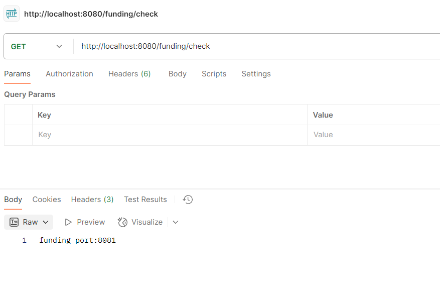

# 🌍 Spring Cloud openFegin 연습해보기

- 이 자료를 볼거라면 실습하기 전에 gateway실습 한거 먼저 보고 오자
<a href="">Spring Cloud Gateway 연습해보기</a>

## 🌐 1. Spring Cloud 의존성 주입하기
- Spring Cloud는 여러 개의 라이브러리를 포함하고 있어서, 각 라이브러리 버전을 개별적으로 지정하면 호환성 문제가 발생할 수 있음
- 이를 방지하기 위해 Spring Cloud 팀에서 BOM을 제공

✔ BOM을 사용하면 Spring Cloud 관련 라이브러리들의 버전을 자동으로 맞춰서, 직접 설정할 필요가 없음

```
ext {
	springCloudVersion = "2024.0.0"  // 최신 Spring Cloud 버전
}

dependencies {
	implementation 'org.springframework.boot:spring-boot-starter-web'
	implementation 'org.springframework.cloud:spring-cloud-starter-openfeign'
	compileOnly 'org.projectlombok:lombok'
	annotationProcessor 'org.projectlombok:lombok'
	testImplementation 'org.springframework.boot:spring-boot-starter-test'
	testRuntimeOnly 'org.junit.platform:junit-platform-launcher'
}

dependencyManagement {
	imports {
		mavenBom "org.springframework.cloud:spring-cloud-dependencies:${springCloudVersion}"
	}
}

```

## 🌐 2. Spring Cloud OpenFegin 기능 활성화 하기
- main 클래스에 어노테이션 추가

```
@EnableFeignClients
@SpringBootApplication
public class FundingApplication {

	public static void main(String[] args) {
		
		SpringApplication.run(FundingApplication.class, args);
	}

}
```

## 🌐 3. 구성 클래스 생성
- 클라이이언트에 대한 구성 클래스 생성
- LoadBalancer가 존재하지 않거나 Ribbon을 쓰지 않는 로컬 환경에서의 구성 클래스는 다음과 같이 진행
- 반면 **LoadBalancer를 사용할 수 있는 환경**이라면 별도의 Client 설정을 처리하지 않아도 된다.
- 그밖에 Client 설정에서 SSL 관련 설정 등 다양한 설정을 할 수 있습니다.

### 참고
- application.yml에서도 부가 설정을 처리할 수 있습니다.
```
spring:
  cloud:
    openfeign:
      httpclient:
        enabled: true
        connection-timeout: 5000 # 통신 요청 후 서버 연결 시간이 5초 경과 시 connection-time out 처리
        ok-http:
          read-timeout: 5000 # 응답 데이터를 읽는 시간이 5초 경과 시 read-time out 처리
```

```
@Configuration
public class FeignConfig {

    // Ribbon 로드 밸런서를 사용하는 것이 기본값이라 이 부분을 null로 처리
    // 처리하지 않을 경우 아래의 오류 메시지 출력
    // No Feign Client for loadBalancing defined. Did you forget to include spring-cloud-starter-loadbalancer?
    @Bean
    public Client feignClient() {
        return new Client.Default(null, null);
    }
}
```

## 🌐 4. 클라이언트 인터페이스를 활용한 마이크로서비스 간 동기 통신


```
// Client 선언부, name 또는 url 사용 가능
// name or value 둘중 하나는 있어야 오류가 안남남
@FeignClient(name = "funding-client", url = "http://localhost:8080")
public interface FundingClient {


    @GetMapping("/funding/check")
    String check();

}
```
- 위의 코드는 gateway 에서 Funding(url은 http://localhost:8081)이라는 마이크로서비스의 특정 엔드포인트로 통신을 요청하는 인터페이스를 설정한 것입니다.
- 클라이언트 어노테이션에 요청을 받을 대상의 URL이나 서비스 이름을 선언할 수 있습니다. 
- 클라이언트가 Funding이라는 마이크로서비스에 보낼 요청에 대한 메서드를 작성할 때 HTTP 메서드와 URI, 리턴값, 요청 헤더와 PathVariable을 모두 선언할 수 있습니다.
- 반대로 Funding이라는 마이크로서비스에서는 gateway가 요청을 보낼 수 있도록 위의 인터페이스에서 선언한 메서드를 그대로 구현하면 됩니다. (메서드 명은 달라도 상관 없지만 mappging url은 반드시 같아야함!!)

**Controller**

```
@RestController
@RequestMapping("/funding")
public class FundingController {

    @Value("${server.port}")
    private String port;

    @GetMapping("/check")
    public String check() {
        return String.format("funding port:%s", port);
    }
}

```



## ✅ 최종 흐름 정리
1️⃣ Client (Postman, React) → GET http://localhost:8080/funding/check 요청 보냄
2️⃣ Spring Cloud Gateway(8080) → 요청 경로 확인 (`/funding/**` 설정 존재)
3️⃣ Gateway가 `http://localhost:8081/funding/check`로 요청 전달
4️⃣ Funding 서비스(8081)에서 요청을 처리하고 응답 반환 ("funding port:8081")
5️⃣ Gateway가 응답을 받아 클라이언트에게 전달
6️⃣ 클라이언트가 최종적으로 "funding port:8081" 응답을 받음

### 참고 자료
<a href="https://velog.io/@mrcocoball2/Spring-Cloud-Spring-Cloud-OpenFeign-%EA%B8%B0%EB%B3%B8-%EA%B0%9C%EB%85%90-%EB%B0%8F-%ED%99%9C%EC%9A%A9">[Spring Cloud] Spring Cloud OpenFeign - 기본 개념 및 활용</a>
<a href="https://docs.spring.io/spring-cloud-openfeign/reference/spring-cloud-openfeign.html">Spring Cloud OpenFeign 공식 문서서</a>