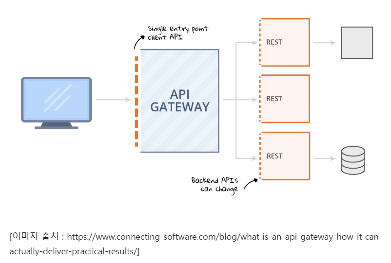
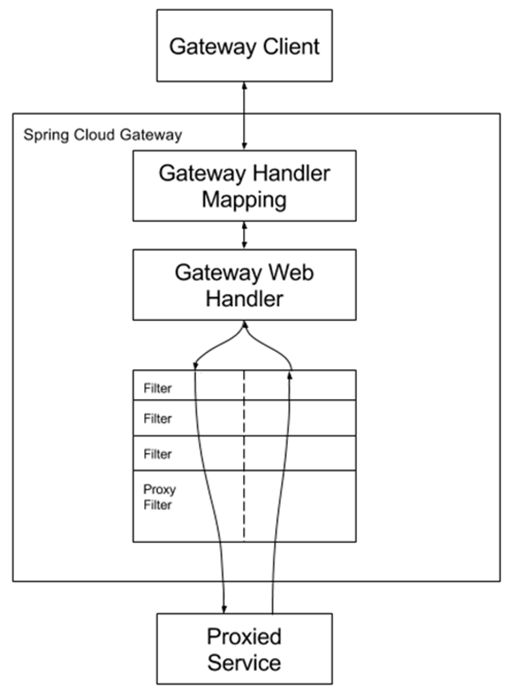

# 🌏 Spring Cloud Gateway

## 🌐 API Gateway 란? 



- 마이크로서비스 관리 / 운영을 위한 플랫폼 패턴이며 해당 패턴에 필요한 기능들을 제공하는 서버
- API 게이트웨이는 개별 서비스의 앞 단에서 모든 서비스들의 엔드포인트를 단일화하고 다음과 같은 필수 기능 요소들을 제공

### 🔖 API Gateway 특징
- **인증과 인가** : 모든 서비스들에 대한 접근에 있어서 단일 진입점에서 인증과 인가 처리를 진행
- **API 요청 로드밸런싱 및 라우팅** : API 요청을 식별하여 적절한 마이크로서비스로 전달
- **QoS(Quality of Service)** : 안정적인 서비스 제공 및 네트워크 품질을 관리하며 사용자 / 클라이언트 / API 단위로 접속 제어
- **로깅 및 모니터링** : API 요청에 대한 로깅 / 모니터링 기능 지원
- **입력 유효성 검사** : API 요청의 적절한 형식과 필수 데이터 포함 여부를 식별 및 관리

### 🔖 API 게이트웨이의 장단점
#### 장점
- **애플리케이션의 내부 구조를 캡슐화** : 클라이언트는 특정 서비스를 호출하지 않고 단순히 게이트웨이와 통신하며, API 게이트웨이는 각 종류의 클라이언트에 특정 API를 제공
- **클라이언트와 애플리케이션 간의 왕복 횟수가 감소하며, 클라이언트 코드 단순화**

#### 단점
- **개발, 배포 및 관리해야 하는 지점이 증가**
- 각 마이크로서비스의 Endpoint를 노출하기 위해 API 게이트웨이를 업데이트해야 하는데 이로 인해 **개발 병목 현상이 발생할 수 있음**

## 🌐 Spring Cloud Gateway란?
- Spring Cloud Gateway는 Spring Framework에서 제공하는 오픈 소스 기반의 Gateway 서비스
- Spring Cloud Gateway 이전에는 Spring Cloud Zuul이 있었으며 Zuul의 패치가 중단됨에 따라 Spring Cloud Gateway로의 이전

#### Spring Cloud Zuul 과 Spring Cloud Gateway의 차이점
- **기반 웹 서버** : Zuul은 Tomcat, Spring Cloud Gateway(이하 SCG)는 Netty
- **동기 / 비동기 방식** : Zuul은 동기 방식, Netty는 비동기 방식
- **웹 프레임워크** : Zuul은 Spring WEB MVC 기반이지만 SCG는 Spring WebFlux 기반

### 🔖 Spring Cloud 아키텍처와 특징



- Spring Cloud Gateway를 구성하는 주요 3요소로는 **Route, Predicate, Filters**가 있으며 사용자의 요청이 각 컴포넌트를 거쳐 라우팅됩니다.

#### Route
- **Route**는 **고유 ID + 목적지 URI + Predicate + Filter**로 구성되며, 아래에서 소개할 Predicate + Filter의 묶음이자 라우팅이 될 규칙
- Route를 통해 SCG로 요청된 URI의 조건이 Predicate를 통과하여 참인 경우 매핑된 해당 경로로 매칭


#### Predicate
- **Predicate는 주어진 요청이 주어진 조건을 충족하는지 테스트하는 구성 요소**이며, 하나 이상의 조건자를 정할 수 있습니다.
- 만약 Predicate에 매칭되지 않을 경우 SCG 자체적으로 HTTP 404 Not Found로 응답합니다.
- 크게 **시간 / URI / 요청 / 네트워크** 관련으로 분류를 할 수 있습니다.

**시간 관련**
- Before : 요청이 특정 시간대 이전에 들어온 것인지 확인
- After : 요청이 특정 시간대 이후에 들어온 것인지 확인
- Between : 요청이 특정 시간대 사이에 들어온 것인지 확인

**URI 관련**
- Path : 요청이 특정 경로로 들어왔는지 확인
- Query : 요청에 특정 파라미터가 포함되어 있는지 확인

**요청 관련**
- Cookie : 요청에 특정 쿠키가 담겨 있는지 확인
- Header : 요청에 특정 헤더가 있는지 확인
- Method : 요청이 특정 HTTP 메서드로 들어왔는지 확인
- Weight : 전체 트래픽에 대해 그룹별 가중치를 두어 그룹별로 요청을 분산시킴

**네트워크 관련**
- Host : 요청이 특정 호스트로 들어왔는지 확인
- RemoteAddr : 요청이 특정 원격 주소로 들어왔는지 확인
    - SCG가 프록시 계층 뒤에 있으면 실제 클라이언트 IP 주소와 일치하지 않을 수 있음
    - 이 경우 사용자 지정을 설정하여 원격 주소를 확인하는 방법을 설정할 수 있음 (RemoteAddressResolver, XForwaredRemoteAddressResolver)


#### Filter & Filter Chain
- **Filter & Filter Chain은 SCG를 통해 들어오는 요청이나 반환되는 응답에 대해 전처리 / 후처리**를 담당합니다.
- 이 중에서 Proxy Filter는 프록시 요청이 처리될 떄 수행되는 필터입니다.
- 정 Route에 적용할 수 있는 Gateway Filter와 전역적으로 적용되는 Global Filter로 분류합니다.

**Gateway Filter**
요청 / 응답 관련
- AddRequestHeader / AddResponseHeader : 요청 / 응답 헤더를 추가
- AddRequestParameter : 요청 시 파라미터를 추가
- RemoveRequestHeader / RemoveResponseHeader : 요청 / 응답 헤더를 삭제
- RemoveRequestParameter : 요청 시 파라미터를 삭제
- DedupeResponseHeader : 이름이 공백인 헤더 이름 목록을 포함할 수 있음
- MapRequestHeader : 새롭게 명명된 헤더를 만들고 기존에 들어온 요청에 명명된 헤더에서 값을 추출하여 넣음
- PrefixPath : 모든 요청의 경로에 접두사를 붙일 수 있음
- RewritePath : 특정 경로를 새 경로로 변환
- RewriteLocationResponseHeader : 응답 헤더의 값 중 Location을 수정
- RewriteResponseHeader : 응답 헤더 값을 수정
- RedirectTo : 300번대 HTTP 상태값에 대해 특정 URI로 리다이렉션할 수 있도록 설정
- SaveSession : Spring Session 사용 시 유용하며 전달된 호출을 만들기 전에 세션 상태가 저장되었는지 확인
- SecureHeaders : 각종 보안 관련 헤더를 추가
- SetPath : 요청 경로를 특정 경로로 변경, 템플릿 세그먼트 허용
- SetRequestHeader / SetResponseHeader : 요청 / 응답 헤더를 지정된 이름으로 대체함
- SetStatus : 특정 HTTP 상태로 설정
- StripPrefix : 요청에서 특정 수만큼 경로를 제거함
- Retry : 재시도해야 하는 횟수, 상태, 메서드, 예외, 백오프 등을 설정
- RequestSize : 요청 크기가 허용 가능한 한도보다 큰지 체크
- SetRequestHost : 기존 호스트 헤더를 지정된 값으로 대체할 수 있음

예외 관련
- CircuitBreaker : Spring Cloud Circuit Breaker 연동, 게이트웨이 경로를 Circuit Breaker로 래핑함
- FallbackHeaders : FallbackHeaders에 전달된 요청의 헤더에 Circuit Breaker 실행 예외 세부 정보를 추가할 수 있음

네트워크 관련
- PreserveHostHeader : HTTP 클라이언트가 결정한 호스트 헤더가 아닌 원래 호스트 헤더를 보내야하는지 결정하기 위해 라우팅 필터가 검사하는 요청 속성을 설정

부하 처리 관련
- RequestRateLimiter : RateLimiter를 통해 현재 요청을 진행할 수 있는지 확인, 진행할 수 없을 경우 HTTP 429 - Too Many Requests 상태가 반환됨

기본 필터 : 모든 경로에 적용하기 위한 필터를 default-filters에 묶어서 지정

Global Filter
- LoadBalancerClientFilter : URL에 lb 체계가 있는 경우 Spring Cloud를 사용하여 LoadBalancerClient 이름을 실제 호스트 및 포트로 확인하고 동일한 속성의 URI를 바꿈
- ReactiveLoadBalancerClientFilter
- WebClientHttpRoutingFilter
- NettyWriteResponseFilter
- RouteToRequestUrlFilter
- GatewayMetricFilter : Spring Boot Actuator와 연결, spring.cloud.gateway.metrics.enabled 속성 설정 시 작동됨. 다음 지표가 Actuator에 추가됨
    - routeId : 경로 ID
    - routeUri : API가 라우팅 되는 URI
    - outcome
    - status
    - httpStatusCode
    - httpMethod


예시 (application.yaml)
```
spring:
  cloud:
    gateway:
      # 먼저 선언한 순서대로 필터가 적용됨 route 1 -> route 2
      routes:
      	# route 1, route의 id는 sample-internal
        - id: sample-internal
          uri: http://localhost:8081
          predicates:
            - Path=/sample/api/v1/internal/** # /sample/api/v1/internal/** 로 들어오는 요청에 반응
          filters:
            - NotAllowedURIExceptionFilter # filter 로직 적용 (커스텀 필터)
        # route 2, route의 id는 sample
        - id: sample
          uri: http://localhost:8081
          predicates:
            - Path=/sample/** # /sample/** 로 들어오는 요청에 반응
          filters:
            - RewritePath=/sample/(?<segment>.*), /$\{segment} # filter 로직 적용 (RewritePath 필터)
```

### HTTPS 적용시 Nginx와 Spring Cloud Gateway 둘중 어떤 걸 사용해야 할까??
일단 Spring Cloud Gateway 단독 사용 (HTTPS 지원 가능)이 가능하다. <br>
하지만 이 방법은 Spring Boot 서버에서 SSL/TLS를 직접 처리해야 하므로, 운영 환경에서는 권장되지 않아.
또한 부하 분산이나 보안적인 이점이 부족해.<br>
따라서 배포 환경에서는 **Nginx에서 HTTPS 처리 + 내부 Gateway는 HTTP 유지**하는 것을 권장한다고 한다.

#### 📌 추천 아키텍처
Nginx에서 HTTPS 적용
- Nginx에서 SSL/TLS를 적용하여 HTTPS 트래픽을 처리
-  Nginx → Spring Cloud Gateway로 프록싱
- Spring Cloud Gateway는 HTTP(80)로 트래픽을 받고, 내부 서비스로 라우팅
Spring Cloud Gateway는 API Gateway 역할에 집중
- 라우팅, 인증/인가, 로깅, 트래픽 제어 등을 담당

#### 같이 사용하는 것이 좋은 이유?
1. 성능 최적화 및 부하 분산
  - Spring Cloud Gateway는 애플리케이션 레벨에서 실행되며, 요청을 처리하는 데 추가적인 리소스를 사용함.
  - 반면, Nginx는 네이티브 C 기반으로 동작하여 성능이 뛰어나고, 많은 요청을 가볍게 처리할 수 있음.
  - 특히, Spring Cloud Gateway가 SSL 핸드셰이크를 직접 수행하면 CPU 부담이 커지므로, SSL Termination을 Nginx에서 처리하는 것이 효율적.

2. SSL/TLS 종료(Termination)
  - Nginx에서 SSL/TLS 종료(TLS Termination)를 수행하면 Spring Cloud Gateway는 내부에서 HTTP(80)로 통신할 수 있어 성능 이점을 얻을 수 있음.
  - Spring Cloud Gateway에서 직접 SSL을 처리하면 Java의 Netty 기반 SSL 처리 방식으로 인해 추가적인 부하 발생.
  - Nginx는 OpenSSL을 활용하여 더 빠르게 암호화를 처리할 수 있음.

3. 로드 밸런싱 및 확장성
  - Nginx는 기본적으로 로드 밸런서를 제공하므로 여러 개의 Spring Cloud Gateway 인스턴스에 요청을 분산 가능.
  - Spring Cloud Gateway 단독으로는 추가적인 로드 밸런싱 설정이 필요하지만, Nginx를 사용하면 Upstream 설정으로 간단하게 해결 가능.

4. 정적 리소스 처리 및 캐싱
  - Spring Cloud Gateway는 API Gateway 역할에 집중해야 하지만, 단독으로 사용하면 정적 리소스(이미지, CSS, JS 등) 요청도 처리해야 함.
  - Nginx를 사용하면 정적 파일은 Nginx에서 직접 제공하고, API 요청만 Spring Cloud Gateway로 전달할 수 있음.
  - 또한, Reverse Proxy 캐싱 기능을 활용하여 API 응답을 캐싱할 수도 있음.

5. 보안 및 방화벽 기능 강화
  - Nginx는 fail2ban이나 mod_security 같은 보안 모듈과 연동하여 DDoS 방어 및 WAF(Web Application Firewall) 기능을 추가할 수 있음.
  - Spring Cloud Gateway 단독으로는 방어 기능이 제한적이므로 Nginx에서 미리 필터링 후 Gateway로 전달하는 것이 보안 측면에서 유리함.

6. Blue-Green 배포 및 무중단 배포 용이
  - Nginx는 upstream을 변경하여 무중단 배포(Rolling Update) 를 쉽게 적용 가능.
  - Spring Cloud Gateway 단독으로 무중단 배포를 적용하려면 복잡한 설정이 필요하지만, Nginx를 사용하면 트래픽을 새로운 인스턴스로 점진적으로 전환하는 것이 용이함.


<a href="https://velog.io/@mrcocoball2/Spring-Cloud-Spring-Cloud-Gateway-%EA%B8%B0%EB%B3%B8-%EA%B0%9C%EB%85%90">[Spring Cloud] Spring Cloud Gateway - 기본 개념</a>
<a href="https://techblog.lotteon.com/%EB%89%B4%EC%98%A8%EC%9D%B4%EB%93%A4%EC%9D%98-%EC%B2%AB-msa-%EC%84%9C%EB%B9%84%EC%8A%A4-%EB%8F%84%EC%A0%84%EA%B8%B0-d336186a7e31">신입사원 개발 정복기 #2. KOKODO의 첫 MSA 서비스 도전기</a>
<a href="https://www.samsungsds.com/kr/insights/msa_and_netflix.html">넷플릭스로 알아보는 MSA</a>
