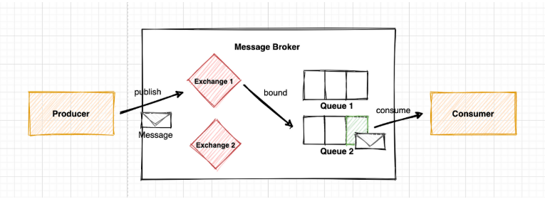
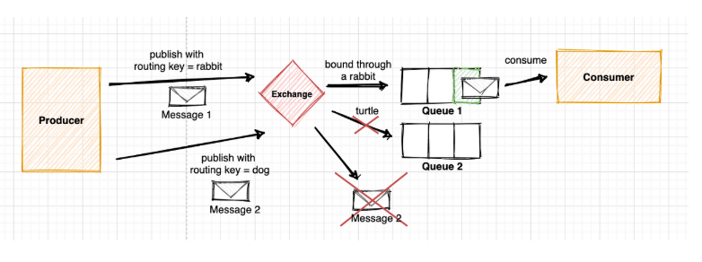
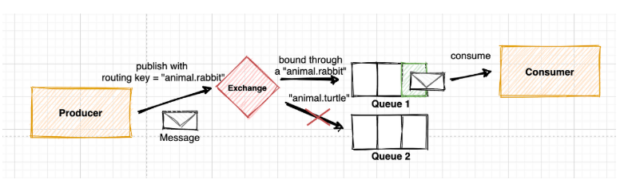
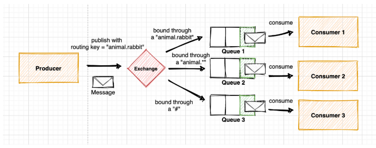
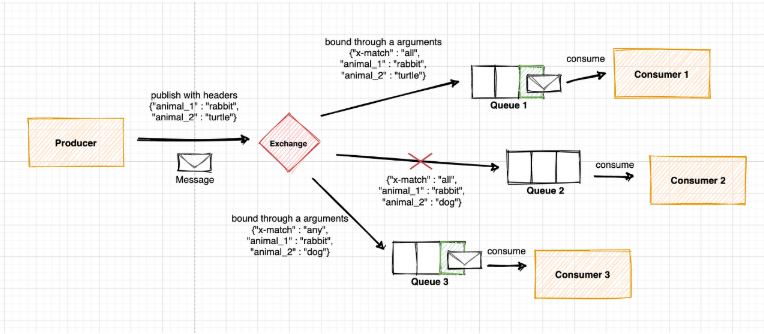
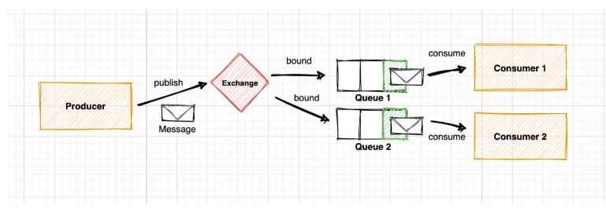
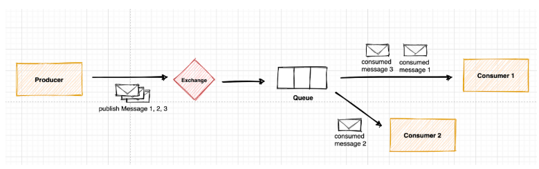

# ✉️ RabbitMQ
- AMQP를 구현한 오픈소스 메세지 브로커
- producers에서 consumers로 메세지(요청)을 전달할 때 중간에서 브로커 역할을 한다.

사용 케이스
- 요청을 많은 사용자에게 전달할 때
- 요청에 대한 처리시간이 길 때
- 많은 작업이 요청되어 처리를 해야 할 떄

해당하는 요청을 다른 API에게 위임하고 빠른 응답을 할 때 많이 사용한다.  
MQ를 사용하면 애플리케이션에 결합도를 낮출 수 있다는 장점이 있다.

## 💎 중요 개념

- **Producer**: 요청을 보내는 주체, 보내고자 하는 메세지를 exchange에 publish한다.
- **Consumer**: producer로부터 메세지를 받아 처리하는 주체
- **Exchange**: producer로부터 전달받은 메세지를 어떤 queue로 보낼지 결정하는 장소, 4가지 타입이 있음
- **Queue**: consumer가 메세지를 consume하기 전까지 보관하는 장소
- **Binding**: Exchange와 Queue의 관계, 보통 사용자가 특정 exchange가 특정 queue를 binding하도록 정의한다. (fanout 타입은 예외)

### 🔖 Binding
- Exchange와 Queue를 연결하는 관계
- 모든 메시지는 Exchange가 가장 먼저 수신하는데 Exchange 타입과 binding 규칙에 따라 적절한 Queue로 전달된다.

### 🔖 Exchange 속성
1. Name : Exchange 이름
2. Type : 메시지 전달 방식
    - Direct : 라우팅 키가 정확히 일치하는 Queue에 메시지 전송
    - Fanout : 해당 Exchange에 등록된 모든 Queue에 메시지 전송 
    - Topic : 라우팅 키 패턴이 일치하는 Queue에 메시지 전송
    - Headers : [key:value]로 이루어진 header값을 기준으로 일치하는 Queue에 메시지 전송
3. Durability: 브로커가 재시작될 때 남아있는지 여부
    - Durable: 브로커가 재시작되어도 디스크에 저장되어 남아있음
    - Transient : 브로커가 재시작되면 사라짐
4. Auto-delete: 마지막 Queue 연결이 해제되면 삭제

### 🔖 Queue 속성
1. Name : Queue이름, **amq.**는 예약어로써 사용불가
2. Durability: 브로커가 재시작될 때 남아있는지 여부
    - Durable: 브로커가 재시작되어도 디스크에 저장되어 남아있음
    - Transient: 브로커가 재시작되면 사라짐
3. Auto delete: 마지막 Consumer가 consume을 끝낼 경우 자동 삭제
4. Argument: 메시지 TTL, Max Length 같은 추가 기능 명시

### 🔖 AMQP 수신 확인 모델
**AMQP**는 네트워크에 문제가 발생하거나 요청을 처리하지 못했을 경우를 대비해 2가지 수신 확인 모델을 가짐
- Consumer가 메세지를 받으면 브로커에게 통지하고, 브로커는 통지를 받았을 때만 queue에서 해당 메세지를 삭제
- 브로커가 메세지를 전달하면 자동으로 삭제

### 🔖 Direct Exchange
- **라우팅 키를 이용**하여 메시지를 전달할 때 정확히 **일치하는 Queue에만** 전송
- 하나의 Queue에 여러 라우팅 키를 지정할 수 있고, 여러 Queue에 같은 라우팅 키를 지정할 수 있음
- **Default Exchange**는 이름이 없는 Direct Exchange이다. 전달된 목적 Queue 이름과 동일한 라우팅 키를 부여한다.

### 🔖 Topic Exchange
- **라우팅 키의 패턴**을 이용해 메시지를 라우팅한다.
- 여러 Consumer에서 메시지 형태에 따라 선택적으로 수신해야하는 경우 등등 다양한 패턴 구현에 활용될 수 있다.

**라우팅 키가 정확히 일치하지 않는 경우**
- binding X

**라우팅 키가 정확히 일치하는 경우**
- "animal.rabbit"이 "animal.* "와 "#" 모두에 일치하기 때문에 모든 Queue에 전송되는 경우
- #은 0개 이상의 단어를 대체

### 🔖 Headers Exchange
- 라우팅을 위해 **header를 사용**(Topic과 차이)
- **producer**에서 정의된 header의 key-value 쌍과 **consumer**에서 정의된 argument의 key-value 쌍이 일치하면 binding된다.
- binding key 만을 사용하는 것보다 더 다양한 속성을 사용할 수 있다.
- 이 타입을 사용하면 binding key는 무시되고, 바인딩 시 지정된 값과 헤더 값이 같은 경우에만 일치하는 것으로 간주된다.

**x-match의 값**에 따라 다르게 동작한다.
- **all** : header의 모든 key-value 쌍 값과 argument의 모든 key-value쌍 값이 일치할 때 binding
- **any** : argument의 key-value 쌍 값 중 하나라도 header의 key-value 쌍 값과 일치할 때 binding

### F🔖 anout
- Exchange에 등록된 모든 Queue에 메시지를 전송한다.

### 🔖 Prefetch Count
- 하나의 Queue에 여러 Consumer가 존재할 경우, Queue는 기본적으로 Round-Robun 방식으로 메시지를 분배한다.
- 이때 예를 들어 홀수 번째 메시지 처리 시간은 짧고, 짝수 번째 메시지 처리 시간이 매우 길 경우, 계속해서 하나의 Consumer만 일을 하게 될 수도 있다.
- 이를 예방하기 위해 Prefetch count를 1로 설정하면, 하나의 메시지가 처리되기 전에는 새로운 메시지를 받지 않게 되므로 작업을 분산시킬 수 있다.

### 출처
<a href="https://velog.io/@sdb016/RabbitMQ-%EA%B8%B0%EC%B4%88-%EA%B0%9C%EB%85%90">[RabbitMQ] 기초 개념</a>

