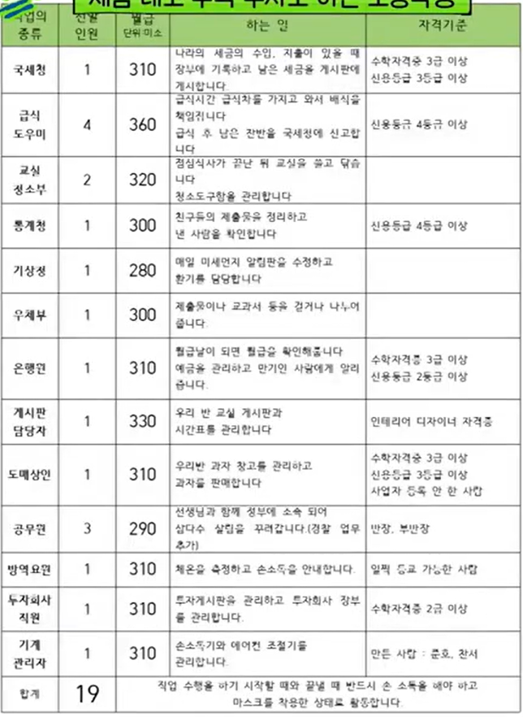

# 초등학생 금융 교육 플랫폼
- 초등학생들을 대상으로 한 학급이 하나의 작은 나라가 된것을 가정하여 경제 관념을 재미있게 학습할 수 있는 플랫폼

## 플랫폼에 존재하는 직업들

1. 국세청 : 나라의 세금의 수입, 지출이 있을 떄 장부에 기록하고 남은 세금을 게시판에 게시
2. 급식도우미 : 급식시간 배식, 식사후 남은 잠반 국세청에 신고
3. 교실 청소부 : 점심시간 끝난후 교실 쓸고 닦기, 청소도구 관리
4. 통계청 : 친구들의 제출물을 정리하고 낸 사람 확인
5. 기상청 : 매일 미세먼지 알림판을 수정하고 환기 담당
6. 우체부 : 제출물 및 교과서를 걷거나 나누어줌
7. 은행원 : 월급날에 월급 확인, 예금 관리 및 만기인 사람에게 알림
8. 게시판 담당자 : 게시판 및 시간표 관리
9. 도매상인 : 과자창고 관리 및 판매
10. 공무원 : 선생님과 함께 정부에 소속되어 나라 살림을 꾸림
11. 방역요원 : 체온을 측정하고 손소독을 안내
12. 투자회사 직원 : 투자게시판 관리, 투자회사 장부 관리
13. 기계 관리자 : 손소독기와 에어컨 조절기 관리

## 게임 특징

### 1. 아이들은 일정날에 월금을 받는데 세금을 제외한 실수령액을 받는다.
- 소득세
- 자리임대료
- 전기 요금
- 건강보험
- 급식비
를 제외한 실수령액을 수령함

### 2. 소비처
- 급식 먼저 먹기 쿠폰
- 선생님과 나들이 쿠폰
- 간식
- 자리 구매 (구매 후 임대도 가능)
- 투자

### 3. 투자
- 투자와 저축의 특징을 알려주기 위한 것

- 선생님의 체중으로 투자을 바탕으로 투자를함
    - 여러 정보들을 알려줌 (아내 생일, 여행 등)

 

