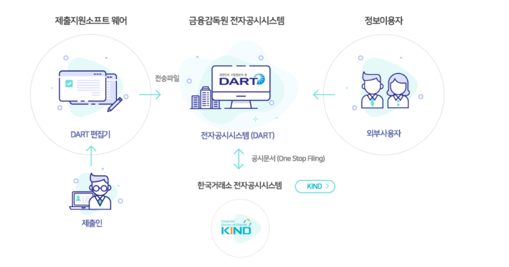
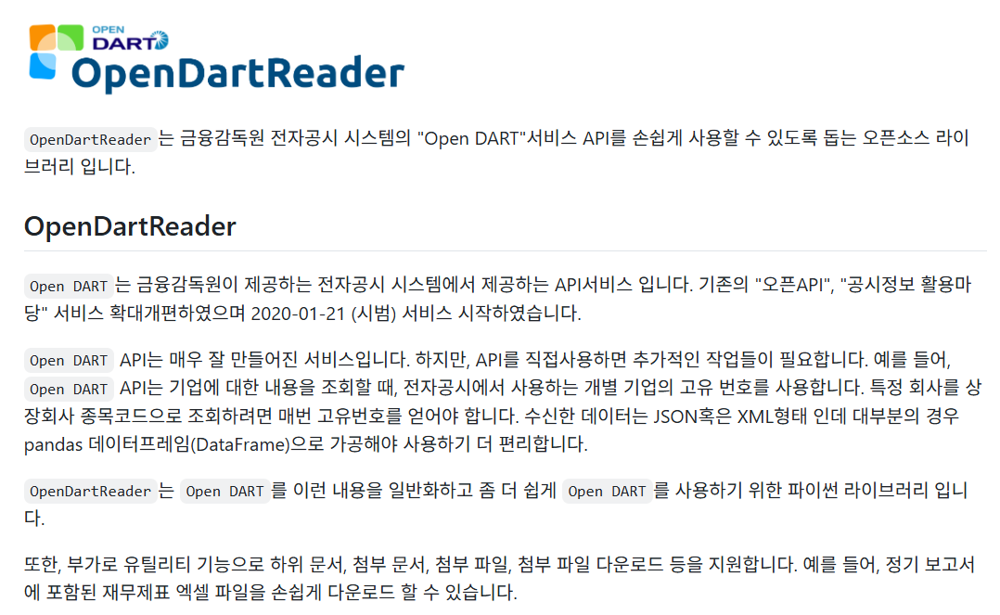
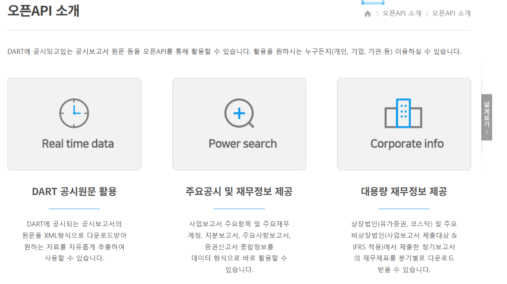
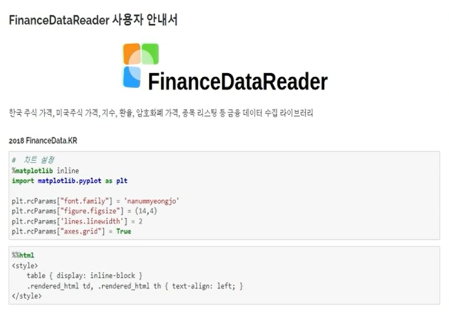

# 1강 금융 데이터 활용

## 목차
1. 전자공시 시스템 (DART)
2. 전자공시 데이터 (OpenDART)
3. 파이선 주가데이터 활용법
4. 과제

## 1. 전자공시시스템 (DART)
- Data Analysis, Retrieval and Transfer System
- 상장법인 등이 공시서류를 인터넷으로 제출하고, 투자자 등 이용자는 제출 즉시 인터넷을 통해 조회할 수 있도록 하는 종합적 기업공시 시스템

### OpenDartReader
- Open DART API 파이썬 패키지(오픈소스 라이브러리)
- https://github.com/FinanceData/OpenDartReader 

### 전자공시시스템 확인 가능 사항
- 정기공시 (가장 중요)
- 발행공시
- 주요사항보고
- 외부감사관련

<a href="https://dart.fss.or.kr/introduction/content2.do">확인 가능 사항 리스트</a>

## 2. OpenDART
- DART에서 공시되고 있는 공식보고서 원문 등 **오픈API**를 통해 활용할 수 있다. 활용을 원하는 누구나(지인, 기업, 기관 등) 이용할 수 있음

## 3. FinanceDataReader
- 긍융데이터 (한국 주식 가격, 미국주식 가격, 지수, 환율, 암호화폐 가격, 종목 리스팅 등) 수집 파이썬 라이브러리
- https://financedata.github.io/index.html
- https://financedata.github.io/posts/finance-data-reader-users-guide.html
- https://github.com/FinanceData/FinanceDataReader

## 4. 과제
- KRX 상장 기업 중 한가지 종목 선정
- 원하는 조회 기간 (조회 시작일 ~ 조회 종료일) 설정
- 선택한 종목의 조회 기간 중 가장 **최신 사업보고서** 찾아 텍스트 파일(.txt)로 저장
- 선택한 종목의 조회 기간에 해당하는 주가 데이터를 캔들차트 그리기

