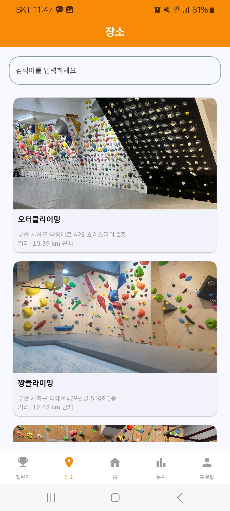
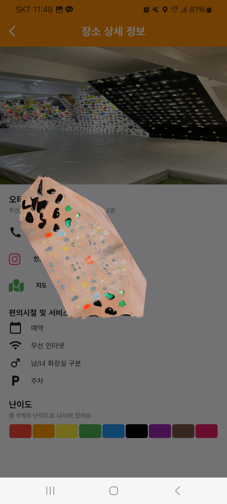
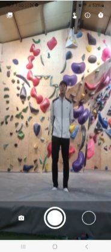
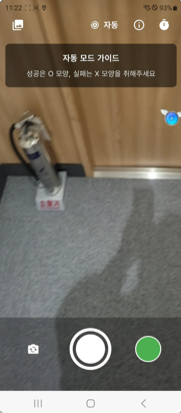
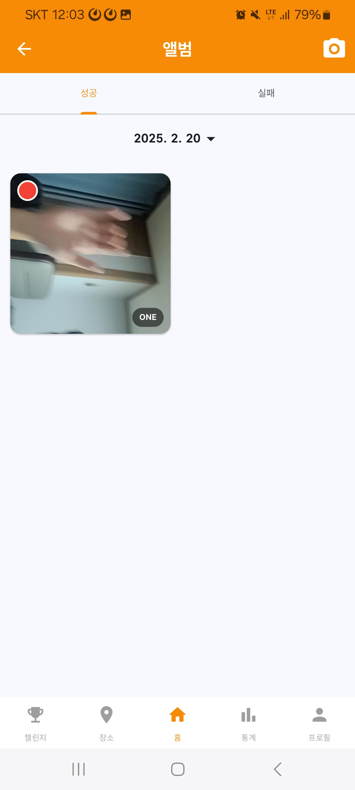
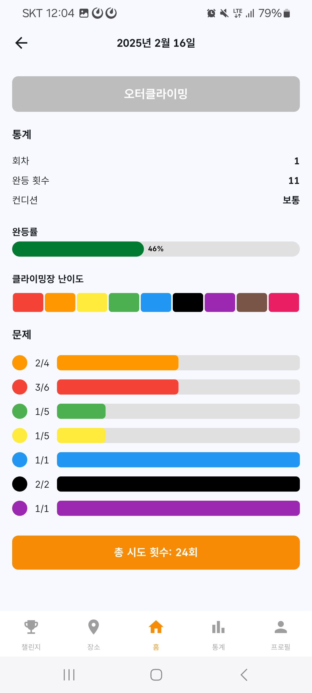
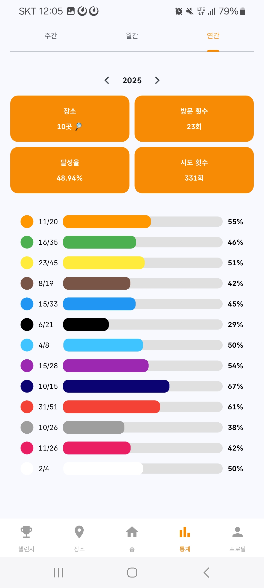
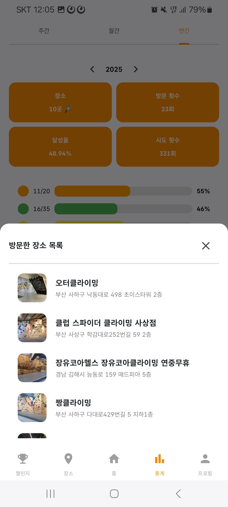
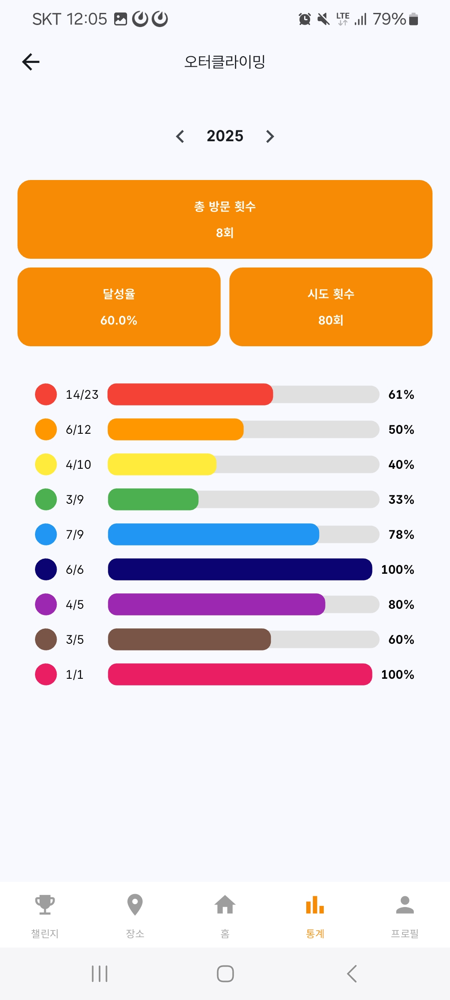

# 시연 시나리오

## 시나리오 (only)
### 1. 로그인
- test01@naver.com 으로 로그인

### 2. HOME (켈린더)
- 끌락이 횟수별 차이 보이게 보여주기
- 일자별 상세는 나중에 

### 3. MyPage

#### 3.1 티어 및 정보 보여주기 

#### 3.2 윙스팬 측정
- 사람 불러서 실제 시연

### 4. 클라이밍장 조회
- 클라이밍장 들어가서 3D 모델링 보여주기

### 5. 챌린지
- push 알림 뜨는거 보여주기
- 해금 버튼 클릭해서 해금
- 해금한 클라이밍장 페이지 상세보기 들어가서 확인

### 6. 영상 촬영

#### 6.1 촬영전 미리 찍은 영상 먼저 보여주기

#### 6.2 실제 시연

### 7. 앨범 캘린더

### 8. 캘린더 상세보기

### 9. 통계 

## 시나리오 (with 스크린샸)

### 1. 로그인

### 2. HOME (켈린더)

### 3. MyPage

#### 3.1 티어 및 정보 보여주기 

#### 3.2 윙스팬 측정

### 4. 클라이밍장 조회

    
    

### 5. 챌린지
- push 알림 뜨는거 보여주기

- 해금 버튼 클릭해서 해금
- 해금한 클라이밍장 페이지 상세보기 들어가서 확인

### 6. 영상 촬영

#### 6.1 촬영전 미리 찍은 영상 먼저 보여주기

#### 6.2 실제 시연

### 7. 앨범 캘린더

### 8. 캘린더 상세보기

### 9. 통계 

    
    
    

