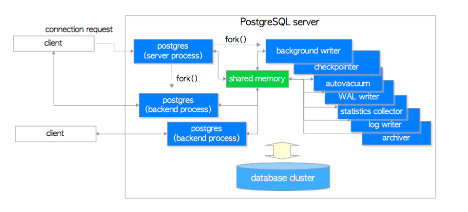
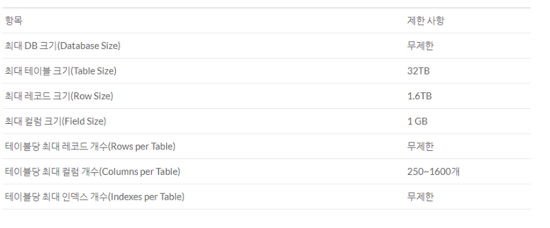

# PostgreSQL

PostgreSQL은 일반적으로 "Post-GRES"로 발음하며 뛰어난 안정성, 유연성, 개방형 기술 표준 지원으로 잘 알려져 있는 오픈 소스 데이터베이스입니다. PostgreSQL는 다른 RDMBS(관계형 데이터베이스 관리 시스템)와는 달리 **비관계형 및 관계형 데이터 유형을 모두 지원**합니다. 따라서, 오늘날 규정을 가장 잘 준수하고, 안정적이며 성숙한 관계형 데이터베이스 중 하나입니다.

### PostgreSQL 구조
PostgreSQL은 클라이언트/서버 모델을 사용한다. 서버는 데이터베이스 파일들을 관리하며, 클라이언트 애플리케이션으로부터 들어오는 연결을 수용하고, 클라이언트를 대신하여 데이터베이스 액션을 수행한다. 서버는 다중 클라이언트 연결을 처리할 수 있는데, 서버는 클라이언트의 연결 요청이 오면 각 커넥션에 대해 새로운 프로세스를 fork한다. 그리고 클라이언트는 기존 서버와의 간섭 없이 새로 생성된 서버 프로세스와 통신하게 된다.

### 객체 괸계형 데이터베이스
PostgreSQL은 전통적인 관계형 데이터베이스의 기능뿐만 아니라, 객체 지향 데이터베이스의 특성도 지원합니다. 예를 들어, 상속, 함수 오버로딩, 사용자 정의 타입 등의 기능을 제공합니다

#### RDBMS와의 차이점
데이타의 저장 및 접근 방법에 대한 관점의 차이
- **RDBMS**는 행과 열이 있는 하나 이상의 관계 또는 테이블의 모음입니다.
- **ORDBMS**는 데이터가 객체로 저장된 것처럼 작동합니다.

### 확장성 및 호환성
PostgreSQL은 사용자 정의 함수, 데이터 타입, 연산자를 지원하여, 확장성이 뛰어납니다. 또한, 여러 프로그래밍 언어와 연동할 수 있는 인터페이스를 제공하며, JDBC, ODBC 등 표준 API를 통한 언어 독립적인 데이터베이스 접근을 지원합니다.

### 기능
복잡한 쿼리, 외래 키(Foreign Key), 트랜잭션, MVCC (Multi-Version Concurrency Control), 고급 인덱싱 기법, 풀 텍스트 검색, 지리공간 데이터 처리 등 다양한 고급 데이터베이스 기능을 내장하고 있습니다.

### 데이터 무결성과 보안
PostgreSQL은 강력한 데이터 무결성을 보장하는 기능을 지원합니다. ACID (원자성, 일관성, 격리성, 지속성) 트랜잭션을 완벽히 지원하며, 복잡한 보안 요구 사항을 충족시키기 위한 다양한 인증 메커니즘과 암호화 옵션을 제공합니다.

