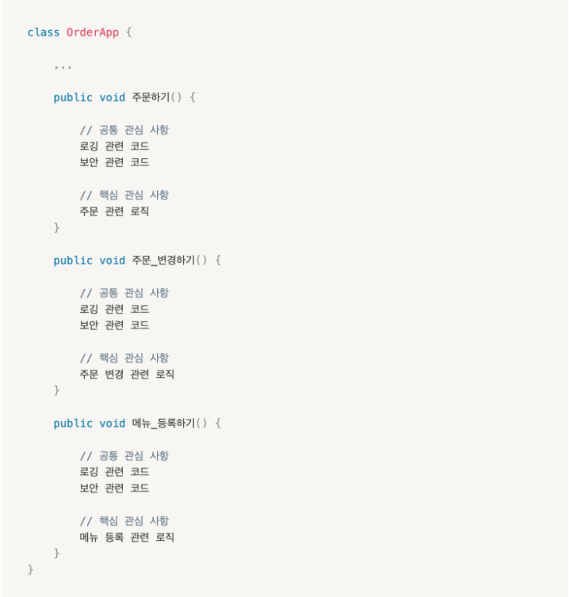

# Spring이란

- 엔터프라이즈용 Java 애플리케이션 개발을 편하게 할 수 있게 해주는 경량급 애플리케이션 프레임워크

**스프링 부트**는 스프링으로 애플리케이션을 만들 때에 필요한 설정을 간편하게 처리해주는 별도의 프레임워크입니다

**엔터프라이즈?** : 개별 사용자가 아니라 조직에서 사용

**경량급??** : 스프링을 사용함으로써 기존 기술을 사용할 때에 불가피하게 작성해야만 했던 불필요하게 복잡한 코드를 제거하여 코드의 복잡성을 낮출 수 있음을 의미

**애플리케이션** 
- 애플리케이션을 개발하는 데에 있어 필요한 모든 업무 분야 및 모든 기술과 관련된 코드들의 뼈대를 제공
- 기본적인 설계나 필요한 라이브러리는 알아서(의존성 주입 해주면) 할테니 개발자는 개발 역량에 집중 !

### 라이브러리와 프레임워크의 차이

#### 라이브러리
- 개발자가 개발을 진행하다. 라이브러리의 필요한 순간을 인지하고 라이브러리를 추가한다.
- 소프트웨어를 개발 할 때 사용되는 자원의 모임, 필요 할때 자유롭게 사용하는 도구

#### 프레임워크

- 개발을 수월하게 하기위해 제공된 소프트웨어 개발 환경이다.
- 사용자가 세세하게 신경쓰지 않아도 기능을 확장하거나 유지보수 할 수 있게 클래스의 구조나 데이터를 처리하는 절차 등에 대한 설계 등에 대한 구조를 제공받는 가이드라인이라 할 수 있다.

- 라이브러리 + 설계도 의 개념으로 의자를 만든다고 가정 할때 의자를 만들 수 있는 공방의 개념 의자를 만드는 설계도, 망치나 못 같은 도구, 어느 정도 자동화된 도구 선택 방식 등이라 할 수 있다.

API(Application Programming Interface)

- 응용 프로그램에서 운영 체제나 프로그래밍 언어가 제공하는 기능을 제어 할 수 있는 인터페이스
- URI를 통해 데이터를 전달 받는 형태가 많고, 구현 혹은 다른 코드와 독립적으로 사용방법이 정의 되어 있다.
- 방을 꾸민다고 할 때 의자 그 자체, 개발과 별개로 다른 코드에 비교적 독립적으로 사용하고
개발자의 의도와 별개로 사용방법을 정의하고 있다.

**인터페이스** 는 서로 다른 장치나 사람 또는 사물 2개 이상의 무언가를 이어주는 매개체

## 스프링 프레임워크의 특징

### POJO (Plain Old Java Object)
- 순수 Java만을 통해서 생성한 객체
- Java의 스펙에 정의된 기술만 사용한다는 것을 의미
- 외부 기술이나 규약의 변화에 얽매이지 않아 보다 유연하게 변화와 확장에 대체할 수 있음
- 객체지향 설계를 제한없이 적용할 수 있으며, 코드가 단순해져 테스트와 디버깅 또한 쉬워짐

### IoC / DI (Inversion of Control / Dependency Injection, 제어의 역전 / 의존성 주입)

A 인스턴스가 B 인스턴스의 메서드를 호출하고 있음
- A는 B와 의존 관계를 맺은 것이라고 할 수 있다
- A가 B의 기능을 가져다가 사용했기 때문

아래 코드는 A는 자신이 사용할 객체를 스스로 생성하지 않고, 생성자를 통해 외부로부터 받아오고 있다.
이 경우 A는 자신이 사용할 객체를 알지 못하고 그저 i에 할당한 인스턴스에 example이라는 메서드가 존재한다는 것만 알고 있다. 그렇다면 누군가 A가 사용할 객체를 결정하고 생성해서 A가 인스턴스화될 때 인자로 전달해야함
그 누군가가 바로 스프링이다. 스프링을 사용하면 애플리케이션의 로직 외부에서 A가 사용할 객체를 별도로 설정할 수 있다. **개발자가 설정 클래스 파일에 A가 사용할 객체를 C로 설정해두면, 애플리케이션이 동작하면서 스프링이 설정 클래스 파일을 해석하고, 개발자가 설정해둔대로 C 객체를 생성하여 A의 생성자의 인자로 C를 전달해준다.**

이처럼 **개발자가 아닌 스프링이 A가 사용할 객체를 생성하여 의존 관계를 맺어주는 것을 IoC(Inversion of Control, 제어의 역전)라고 하며, 그 과정에서 C를 A의 생성자를 통해 주입해주는 것을 DI(Dependency Injection, 의존성 주입)라고 합니다.**

### AOP (Aspect Oriented Programming, 관심 지향 프로그래밍)

- 애플리케이션을 개발할 때에 구현해야 하는 기능들은 크게 **공통 관심 사항**과 **핵심 관심 사항**으로 분류할 수 있습니다. 먼저, **핵심 관심 사항은 애플리케이션의 핵심 기능과 관련된 관심 사항**으로, 커피 주문 애플리케이션을 예로 든다면 메뉴 등록하기, 주문하기, 주문 변경하기 등이 있을 것입니다.

- 반면, **공통 관심 사항은 모든 핵심 관심 사항에 공통적으로 적용되는 관심 사항들을 의미합니다.** 예를 들어, 메뉴 등록하기, 주문하기, 주문 변경하기 등 모든 핵심 관심 사항에는 로깅이나 보안 등과 관련된 기능들이 공통적으로 적용되어야만 합니다.

- 이 때, 핵심 관심 사항과 공통 관심 사항이 코드에 아래와 같이 함께 모여 있으면 필연적으로 **공통 관심 사항과 관련된 코드가 중복**될 수밖에 없습니다. 이처럼 코드가 중복되어져 있는 경우, **공통 관심 사항을 수행하는 로직이 변경되면 모든 중복 코드를 찾아서 일일이 수정해주어야만 합니다.**

위의 예제에서 발생하는 코드의 중복이라는 문제를 해결하기 위해서는 공통 관심 사항과 관련된 기능들을 별도의 객체로 분리해낸 다음, 분리해낸 객체의 메서드를 통해 공통 관심 사항을 구현한 코드를 실행시킬 수 있도록 해야 합니다. 이처럼, **애플리케이션 전반에 걸쳐 적용되는 공통 기능을 비즈니스 로직으로부터 분리해내는 것**을 **AOP(Aspect Oriented Programming, 관심 지향 프로그래밍)**라고 합니다.

PSA (Portable Service Abstraction, 일관된 서비스 추상화)
- MySQL을 사용했는데 Maria DB로 데이터베이스를 바꿔야하는 상황이 온다면 일반적으로는 기존의 작성한 코드를 전부 지우고 새로 작성하거나, 기존 데이터베이스와 새로운 데이터 베이스 간에 사용 방법이 다른 코드를 모두 찾아서 일일이 수정해야 함. 
- 스프링을 사용하면 동일한 사용방법을 유지한 채로 데이터베이스를 바꿀 수 있습니다. 이는 스프링이 데이터베이스 서비스를 추상화한 인터페이스를 제공해주기 때문에 가능합니다. 즉, 스프링은 Java를 사용하여 데이터베이스에 접근하는 방법을 규정한 인터페이스를 제공하고 있으며, 이를 JDBC(Java DataBase Connectivity)라고 합니다.

- 각 데이터베이스를 만든 회사들은 자신의 데이터베이스에 접근하는 드라이버를 Java 코드의 형태로 배포하는데, **이 드라이버에 해당하는 Java 코드의 클래스가 JDBC를 구현합니다.** 따라서, JDBC를 기반으로 하여 데이터베이스 접근 코드를 작성해두면, 이후에 데이터베이스를 바꾸어도 기존에 작성한 데이터베이스 접근 로직을 그대로 사용할 수 있습니다.

이러한 JDBC처럼 **특정 기술과 관련된 서비스를 추상화하여 일관된 방식으로 사용될 수 있도록 한 것을 PSA(Portable Service Abstraction, 일관된 서비스 추상화)라고 합니다.**

### 스프링 웹 계층
- 스프링 계층은 **Presentaion Layer, Business Layer, Date Access Layer** 크게 3개로 나눌 수 있다

#### Presentaion Layer
- 브라우저상의 웹 클라이언트의 요청 및 응답을 처리
- 서비스계층, 데이터 엑세스 계층에서 발생하는 Exception을 처리
- @Controller 어노테이션을 사용하여 작성된 Controller 클래스가 이 계층에 속함

#### Service Layer
- 애플리케이션 비즈니스 로직 처리와 비즈니스와 관련된 도메인 모델의 적합성 검증
- 트랜잭션 관리
- 프레젠테이션 계층과 데이터 엑세스 계층 사이를 연결하는 역할로서 두 계층이 직접적으로 통신하지 않게 함
- Service 인터페이스와 @Service 어노테이션을 사용하여 작성된 Service 구현 클래스가 이 계층에 속함

#### Data Access Layer
- ORM (Mybatis, Hibernate)를 주로 사용하는 계층
- DAO 인터페이스와 @Repository 어노테이션을 사용하여 작성된 DAO 구현 클래스가 이 계층에 속함 
- Dabase에 data를 CRUD(Create, Read, Update, Drop)하는 계층

#### Domain Model Layer
- DB의 테이블과 매칭될 클래스
- Entity 클래스라고도 부른다. 

#### DTO(Data Tranfer Object)
- 각 계층간 데이터 교환을 위한 객체 (데이터를 주고 받을 포맷)
- Domain, VO라고도 부름
- DB에서 데이터를 얻어 Service, Controller 등으로 보낼 때 사용함
- 로직을 갖지 않고 순수하게 getter, setter 메소드를 가진다.
 

#### DAO(Data Access Object)
- DB에 접근하는 객체, DB를 사용해 데이터를 조작하는 기능을 하는 객체 (MyBatis 사용시에 DAO or Mapper 사용)
- Repository라고도 부름(JPA 사용시 Repository 사용)
- Service 계층과 DB를 연결하는 고리 역할을 한다.
 

#### Entity 클래스란?
- Domain 이라고도 부름 (JPA 사용할 때 사용)
- 실제 DB 테이블과 매칭될 클래스
- Entity 클래스 또는 가장 Core한 클래스라고 부름
- Domain 로직만을 가지고 있어야하며 Presentation Logic을 가지고 있어서는 안된다.
 

#### Domain 클래스와 DTO 클래스를 분리하는 이유
- View Layer와 DB Layer의 역할을 철저하게 분리하기 위해서
- 테이블과 매핑되는 Entity 클래스가 변경되면 여러 클래스에 영향을 끼치게 되지만 View와 통신하는 DTO 클래스는 자주 변경되므로 분리해야 한다.
- 즉 DTO는 Domain Model을 복사한 형태로, 다양한 Presentation Logic을 추가한 정도로 사용하며 Domain Model 객체는 Persistent만을 위해서 사용한다.

#### RestController와 @Service를 나누는 이유
- @Service를 만들어서 나누는 이유는 중복되는 코드가 생기기 때문이다.
- 비즈니스 로직은 다른 요청 URL에서 사용해야 하는 경우가 있다. 만약 비즈니스 로직 코드가 컨트롤러에 구현되어 있는 경우, 다른 컨트롤러의 핸들러 메소드에서 똑같은 로직코드를 구현해야하니 중복코드가 발생하고 재사용성이 줄어든다.
- 중복되는 코드가 발생하면 따로 모듈화를 해서 나눠주는 것이 유지 보수하기 편리하다. (NodeJS => 모듈화)
- 모든 기능들을 세분화해서 @Service에 작성하게 되면 나중에는 서비스의 기능들을 조합만 해서 새로운 기능을 만들 수 있음
서비스에서 다른 서비스를 의존성 참조하는 것도 가능하다.
 

즉, 비즈니스 로직의 서비스 구현체에서 구현하는 이유는 바로 확장성과 재사용성 그리고 중복 코드의 제거이다. 

#### Reference
- medium.com/webeveloper/spring-mvc-architecture-236235d48fa1
- https://gmlwjd9405.github.io/2018/12/25/difference-dao-dto-entity.html